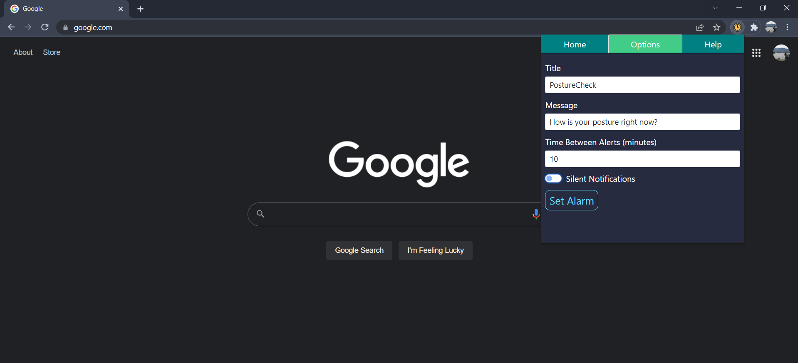
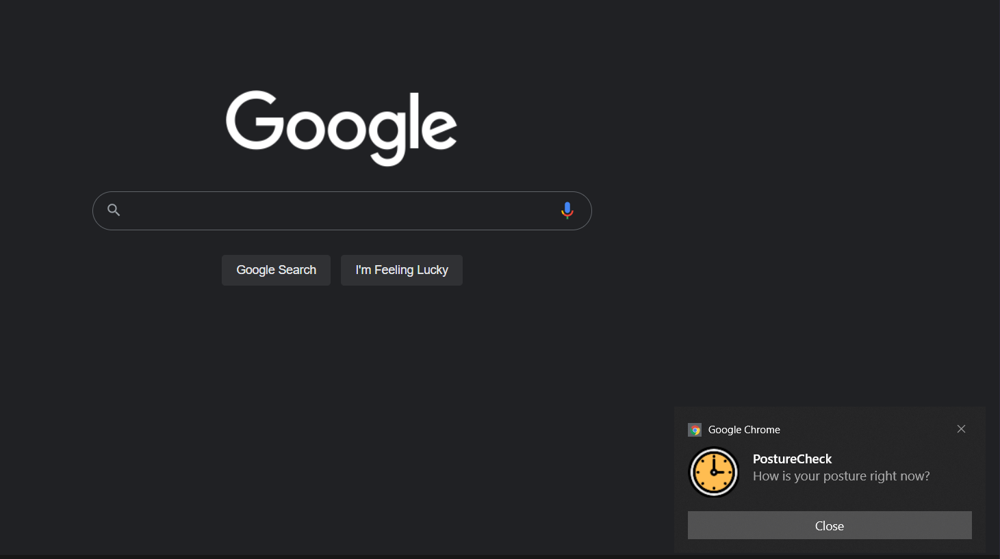

# Overview

PostureCheck is a Google Chrome extension designed to send notifications at a specified interval to remind you to check in on your posture while you use your computer. Although with the options provided you can use PostureCheck to create a reminder for anything you like (e.g. standing up, drinking water, eating, etc).

# Setup

In order to use this Google Chrome extension, you'll need to download the project onto your computer. You can do this by downloading clicking the green "Code" button above, and selecting "Download ZIP". Once the .zip file has finished downloading, right click it on your desktop or file explorer and unpack it to a folder.

Before you can load this extension into Google Chrome, you'll have to enable "Developer mode" by typing in "chrome://extensions/" into the search bar and enabling the setting there.

Once you have Developer mode enabled, click "Load unpacked" on the "chrome://extensions/" page, locate the folder you unzipped the project to, and select the "dist" folder to upload. You should now see PostureCheck in your extensions toolbar (you may first need to click on your extensions toolbar and pin PostureCheck before you can see it there).

# Using PostureCheck

Once you have installed PostureCheck, you can create your alarm by clicking the icon in your extensions toolbar.

To create your alarm, you can start by navigating to the Options tab, or by clicking the "Create Alarm" button on the Home tab which will also take you to the Options tab. Within the Options tab
you can you can edit the title and message for your notifications, adjust how often you want your alarm to go off, and can choose to have silent notifications that will not make any noise when they appear. So really you can create a notification for anything you want, not just posture.
Once you have adjusted your settings to your liking, click "Set Alarm" to start your alarm. One note is that I have the maximum time interval you can set capped at three hours.

View how much time is left before your alarm goes off back in the Home tab. Once your alarm is set you will have buttons there to pause and resume your alarm, as well as cancelling it altogether.

PostureCheck won't send notifications if you are away from your computer, as it will choose to skip sending a notification if your alarm goes off while you have been idle for 5 or more minutes. It also may or may not show notifications when you are in full-screen mode depending on your system preferences.

Once your alarm goes off, a notification with your options will appear. The alarm will then start counting down again. The appearence of the notification may vary depending on your computer's operating system, this screenshot was taken while running on Windows 10.

# Troubleshooting

When you initially load the extension at chrome://extensions, you may see an error button show up on the extension. This is safe to ignore, it just says that the manifest version being used is deprecated, and that support will be removed in 2023. More information below about the migration to the next manifest version.

If you are having general issues with the alarm, timer, etc., it may help to reset the extension at chrome://extensions. It will clear the existing alarm and the local storage within Chrome this extension utilizes. It will also reset the options to their default settings.

If you are using Windows 10 and your alarm is not going off when it is time, make sure your Focus Assist setting in your system preferences is set to "Off". If it is set to "Priority Only" or "Alarms Only" then notifications will not come into view when your alarm goes off.

# Manifest V3

Currently this extension uses Google's Manifest V2 extension platform, which will be fully deprecated in 2023. The reason for this is that service workers, which were introduced in V3 as a replacement for background pages does not adequately solve the use case that background pages solve for this project. Background pages are what PostureCheck uses to register the alarms and event listeners it needs to create and update alarms based on your options, and dispatch notifications to you. Manifest V3's service workers have a very short lifespan (typically 30 seconds based on what I've observed), and will go inactive resulting in the user not receiving any notifications. There are some hacks/workarounds around that can allow for a service worker to extend its lifetime by opening runtime ports with either a connectable tab or a dedicated tab (https://stackoverflow.com/questions/66618136/persistent-service-worker-in-chrome-extension). However neither of these were solutions I was very fond of. The downside of using a connectable tab being that the connection would only be alive for 5 minutes, after which I would have the same problem of my alarms and event listeners being terminated likely before an alarm goes off. And I did not want a user to have to bother with keeping a dedicated tab open for a program that is designed to run in the background.
With the Chrome Web web store no longer accepting new applications for extensions using Manifest V2, and Manifest V2 extensions being disabled from running in Chrome starting January 2023, I will continue looking for ways to migrate this extension over to V3. However during my research into this I found posts from many developers that use notifications that were also unable to migrate to V3 for this same reason of their service workers going inactive.
