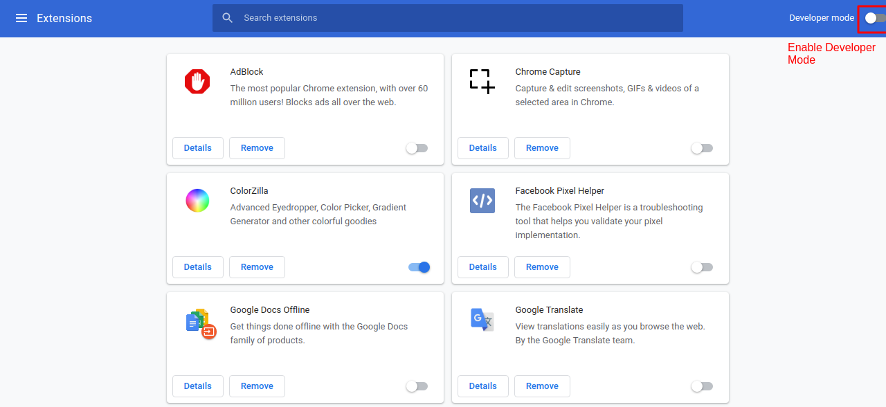

# PostureCheck

## Overview

PostureCheck is a Google Chrome extension designed to send notifications at a specified interval to remind you to check in on your posture while you use your computer. Although with the options provided you can use PostureCheck to create a reminder for anything you like (e.g. standing up, drinking water, eating, etc).

## Setup

In order to use this Google Chrome extension, you'll need to download the project onto your computer. You can do this by downloading the .zip file and then extracting it to a folder.

Before you can load this extension into Google Chrome, you'll have to enable "Developer mode" by typing in "chrome://extensions/" into the search bar and enabling the setting there.

Once you have Developer mode enabled, click "Load unpacked" on the "chrome://extensions/" page and select the folder you previously unzipped the project to. You should see PostureCheck now in your extensions toolbar (you may first need to click on your extensions toolbar and pin StarFree before you can see it there).

## Using PostureCheck

Once you have installed PostureCheck, you can create your alarm by clicking the icon in your extensions toolbar.

## Troubleshooting

If you are using Windows 10 and your alarm is not going off when it is time, make sure your Focus Assist setting set to "Off". If it is set to "Priority Only" or "Alarms Only" then notifications will not come into view.
